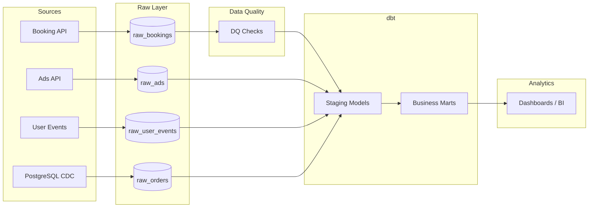

# Travel Analytics Data Platform

Production-style Data Engineering portfolio project demonstrating a modern analytics platform built with Python, Airflow, dbt, ClickHouse, Kafka, and Debezium.

---

# Overview

This project simulates a real-world travel company analytics platform.

It ingests data from multiple sources, validates data quality, transforms data with dbt, and builds analytical marts for reporting and business intelligence.

The project emphasizes engineering practices commonly used in production environments:

- Layered data architecture
- Data Quality checks
- CDC pipelines
- Event-driven architecture
- Analytics Engineering with dbt
- Workflow orchestration with Airflow
- Infrastructure as Code with Docker

---

# Architecture



---

# Technology Stack

| Category | Technologies |
|-----------|--------------|
| Language | Python |
| Orchestration | Apache Airflow |
| Transformation | dbt |
| Storage | ClickHouse |
| Event Streaming | Kafka |
| CDC | Debezium |
| Schema Management | Schema Registry + Avro |
| Containers | Docker Compose |

---

# Project Structure

```text
.
├── airflow/
├── dbt/
├── docker/
├── services/
├── monitoring/
├── docs/
└── docker-compose.yml
```

---

# Data Pipelines

## Booking Analytics

Booking API

↓

Raw Layer

↓

Data Quality

↓

dbt Staging

↓

Business Marts

---

## Advertising Analytics

Ads API

↓

Raw Layer

↓

Staging

↓

Ad Performance Mart

---

## User Events

User Events

↓

Staging

↓

- Funnel Mart
- Booking Conversion Mart

---

## Orders

PostgreSQL

↓

Debezium CDC

↓

Kafka

↓

Raw Layer

↓

Staging

↓

Orders Marts

---

# Data Quality

Implemented quality checks include:

- Freshness
- Completeness
- Uniqueness
- dbt Tests
- Source validation

---

# Running the Platform

Start services

```bash
docker compose up -d
```

Initialize platform

```bash
make init
```

Run dbt models

```bash
dbt run
```

Run dbt tests

```bash
dbt test
```

Trigger the complete platform refresh

```bash
airflow dags trigger platform_daily_refresh
```

---

# Documentation

Additional documentation is available in:

```
docs/
├── architecture.md
├── data-flow.md
├── runbook.md
└── adr/
    ├── 001-kafka.md
    ├── 002-clickhouse.md
    ├── 003-cdc.md
    └── 004-avro.md
```

---

# Engineering Highlights

- Multi-source analytics platform
- Layered data architecture
- Event-driven pipelines
- CDC with Debezium
- dbt-based Analytics Engineering
- Airflow orchestration
- Automated Data Quality
- Production-oriented project structure

---
