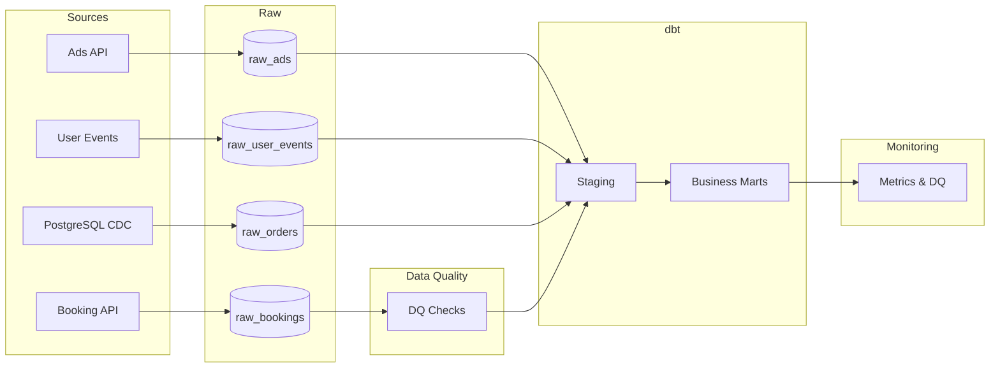

# Architecture

## Overview

The Travel Analytics Data Platform is an end-to-end analytics platform built around a layered architecture.

Data is ingested from multiple sources, validated, transformed with dbt, and exposed through analytics marts.

## Technology Stack

- Airflow
- Python
- ClickHouse
- dbt
- Kafka
- Debezium CDC
- Schema Registry
- Docker

## Architecture

## Layers

### Raw

Immutable landing zone.

### Data Quality

Freshness, completeness and uniqueness validation.

### Staging

Business-ready normalized datasets built with dbt.

### Marts

Business metrics optimized for BI and analytics.